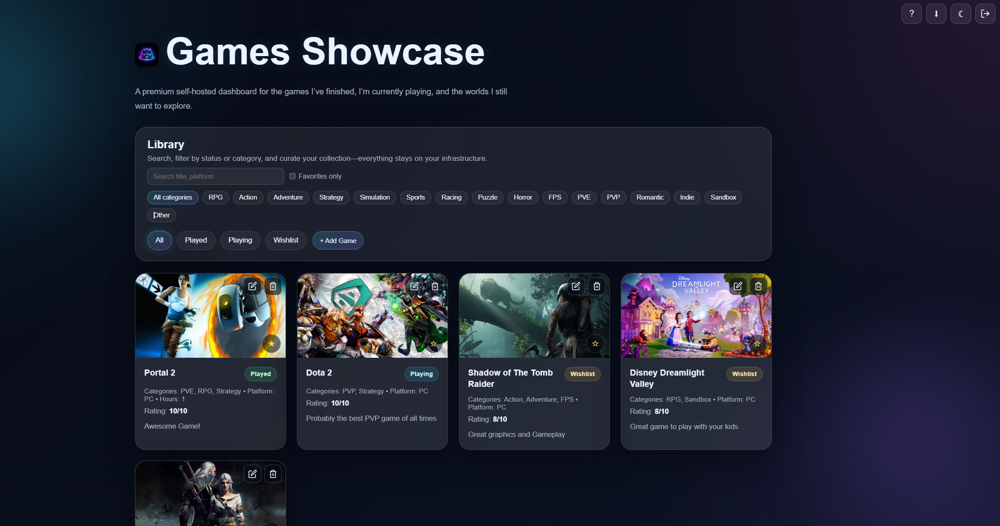
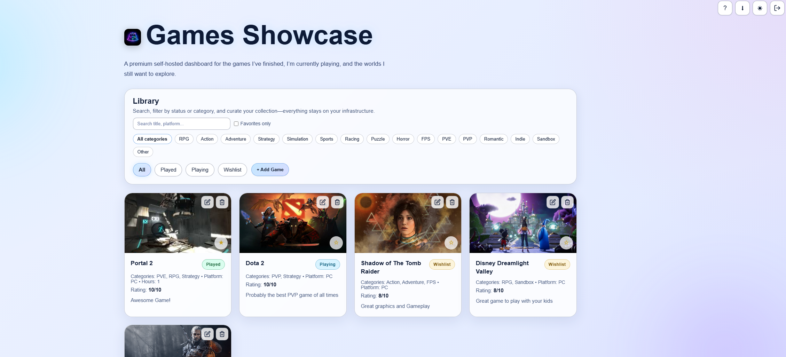
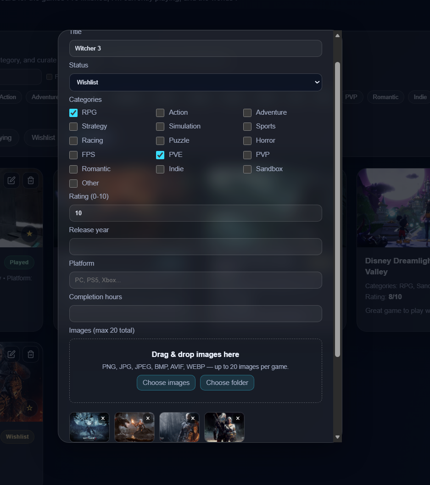

<p align="center">
  <strong>Games Showcase</strong><br/>
  <sub>A premium self-hosted dashboard for the games you’ve finished, you’re playing, and the worlds you still want to explore.</sub>
</p>

<p align="center">
  
  
  
</p>

---

## Overview

**Games Showcase** is a private, multi-user web app to catalog your game library: status (played / playing / wishlist), categories, ratings, platforms, completion time, favorites, notes, and image galleries with slideshow. Export your visible library to **PDF**, switch **light / dark** themes, and keep everything on **your** machine.

---

## Screenshots

<p align="center">
  <br/>
  <em>Dark theme — library & filters</em>
</p>

<p align="center">
  <br/>
  <em>Light theme — same layout, tuned for readability</em>
</p>

<p align="center">
  <br/>
  <em>Add / edit game — categories, media, notes</em>
</p>

> **Renaming your files:** Put PNGs in [`Screenshots/`](Screenshots/) as `screenshot-dark.png`, `screenshot-light.png`, and `screenshot-modal.png`, or update the image paths in this file. Details in [`Screenshots/README.md`](Screenshots/README.md).

---

## Features

| | |
|---|---|
| **Accounts** | Register, login, session-based auth; data scoped per user |
| **Library** | Search, filter by status & category, favorites-only toggle |
| **Games** | Title, status, multi-category chips, rating, year, platform, hours, notes |
| **Media** | Up to 20 images per game, drag-and-drop & folder upload, cover + slideshow |
| **Export** | PDF export of games currently visible in the grid |
| **UI** | Glass-style UI, responsive layout, light/dark theme, in-app help |

---

## Tech stack

- **Backend:** [FastAPI](https://fastapi.tiangolo.com/), [Uvicorn](https://www.uvicorn.org/), [SQLAlchemy](https://www.sqlalchemy.org/) + SQLite  
- **Auth:** Signed cookies ([Starlette sessions](https://www.starlette.io/middleware/#sessionsmiddleware)), [Passlib](https://passlib.readthedocs.io/) (PBKDF2-SHA256)  
- **Frontend:** Jinja2 templates, vanilla JS, custom CSS  
- **PDF:** [ReportLab](https://www.reportlab.com/)

---

## Requirements

- **Python 3.10+** recommended  
- `pip` (or another PEP 517 installer)

---

## Quick start

```bash
# Clone
git clone https://github.com/manxlr/games-showcase.git
cd games-showcase

# Virtual environment (recommended)
python -m venv venv
# Windows:
venv\Scripts\activate
# Linux / macOS:
# source venv/bin/activate

pip install -r requirements.txt
```

### Run the app

```bash
python run.py
```

Open **http://127.0.0.1:4000** — register a user, then sign in.

### Production-ish settings

Set a strong session secret (required for real deployments):

```bash
# Windows PowerShell
$env:SESSION_SECRET = "your-long-random-secret"

# Linux / macOS
export SESSION_SECRET="your-long-random-secret"
```

Then start with the same `python run.py` (or run `uvicorn` directly — see `run.py` for host/port).

---

## Data layout

| Path | Purpose |
|------|---------|
| `data/games.db` | SQLite database (created on first run) |
| `data/uploads/` | Uploaded game images |

Both are **gitignored** by default so your library never gets committed by accident.

---

## API & docs

With the app running, interactive OpenAPI docs are at:

- **Swagger UI:** [http://127.0.0.1:4000/docs](http://127.0.0.1:4000/docs)  
- **ReDoc:** [http://127.0.0.1:4000/redoc](http://127.0.0.1:4000/redoc)

Health check: `GET /health`

---

## Branding (optional)

Add `app/static/icons/icon.png` and `app/static/icons/favicon.ico` for the navbar logo and browser tab icon. See [`app/static/icons/README.txt`](app/static/icons/README.txt).

---

## Roadmap

- [ ] Docker / Docker Compose  
- [ ] Optional desktop wrapper (Windows / Linux)  

Contributions and ideas are welcome via issues and pull requests.

---

## License

This project is released under the [MIT License](LICENSE).

---

## Author

**[@manxlr](https://github.com/manxlr)**
